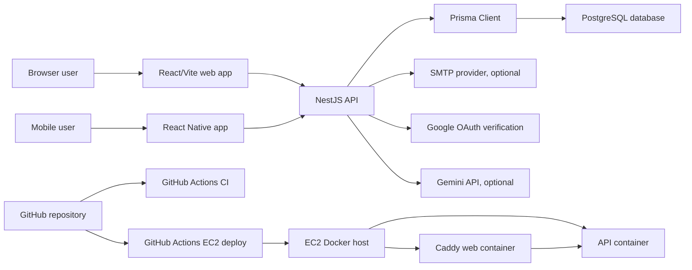
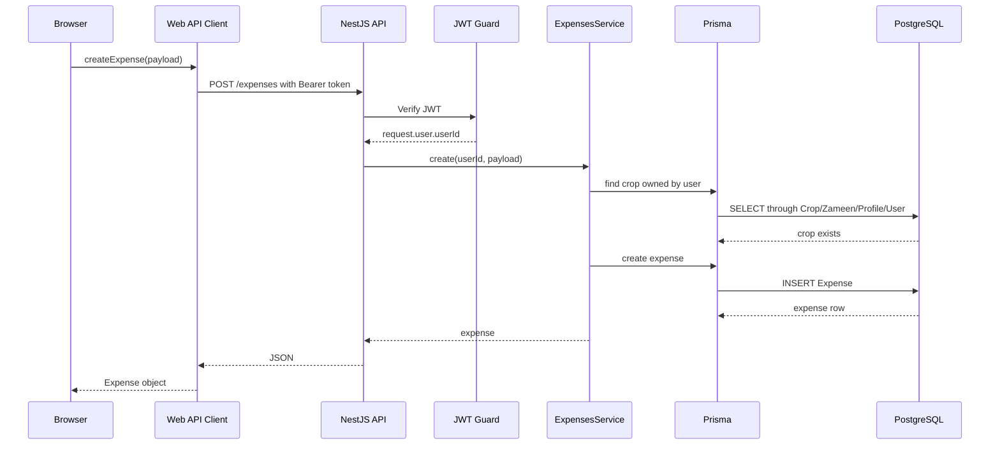

# Zamindar Plus Detailed Project Report

Last reviewed: 2026-06-19

This document explains the Zamindar Plus project from top to bottom: repository structure, frontend, backend, database, APIs, mobile app, Docker setup, CI/CD, deployment flow, security model, and how the pieces communicate.

No real secret values are documented here. Environment variables are explained by name and purpose only.

## 1. Project Summary

Zamindar Plus is a farm ledger platform. It lets a farmer or farm manager keep structured records for:

- Account registration, sign in, email verification, password reset, Google sign-in, and Google account connection.
- User settings such as profile picture, preferred area unit, currency, language, notification toggles, and theme.
- Profiles: logical farm books or farmer/family/farm profiles.
- Zameen: land records attached to profiles.
- Crops: crop cycles attached to zameen.
- Expenses: kharcha records attached to crops.
- Income: sales or received/pending income records attached to crops.
- Reports: summary, crop profitability, monthly movement, CSV exports, and print.
- Zamindar AI: a project-focused assistant for farm ledger questions.
- Mobile app: React Native CLI app that uses the same backend API.

The project is a private npm workspace monorepo:

```text
zamindar-plus/
  apps/
    api/      NestJS backend
    web/      React + Vite web app
    mobile/   React Native CLI app
  packages/
    shared/   Shared utilities used across apps
  .github/
    workflows/ci.yml
    workflows/deploy-ec2.yml
  docs/
    deployment-ec2-docker.md
  scripts/
    deploy-ec2-docker.sh
```

## 2. High-Level Architecture



The frontend does not directly talk to PostgreSQL. It talks to the NestJS API. The API validates requests, checks authentication and ownership, then uses Prisma to read/write PostgreSQL.

## 3. Main Technology Choices

### Web

- React 19
- Vite 8
- TypeScript
- React Compiler through Vite/Babel
- Framer Motion for page transitions and UI animation
- Lucide React for icons

### Backend

- NestJS 11
- TypeScript
- Prisma 7
- PostgreSQL
- JWT authentication
- bcrypt password hashing
- Nodemailer for SMTP email
- Google Auth Library for Google sign-in token verification

### Mobile

- React Native CLI
- TypeScript
- AsyncStorage for JWT persistence
- React Native Safe Area Context
- Same backend API as the web app

### Runtime and Deployment

- Local PostgreSQL via Docker Compose
- Production web/API via Docker Compose
- Caddy for HTTPS, static web serving, and API reverse proxy
- GitHub Actions for CI and optional EC2 deployment

## 4. Repository Structure and File Purposes

### Root Files

| File | Purpose |
| --- | --- |
| `package.json` | Root npm workspace config. Defines scripts for web, API, mobile, Prisma, checks, tests, and workspace paths. |
| `package-lock.json` | Locked dependency tree for reproducible installs. |
| `README.md` | Short project overview, local setup, commands, and notes. |
| `.gitignore` | Prevents committing `node_modules`, env files, build output, logs, caches, and local artifacts. |
| `.gitattributes` | Forces LF line endings for shell/YAML/Docker/Caddy files so Linux deployment works correctly. |
| `.dockerignore` | Keeps Docker build context smaller and prevents secrets/build artifacts from being copied into Docker images. |
| `.env.example` | Root local environment template. Safe placeholder values only. |
| `.env.production.example` | Production environment template for EC2/RDS/Caddy deployment. Safe placeholder values only. |
| `docker-compose.yml` | Local PostgreSQL-only runtime for development. |
| `docker-compose.prod.yml` | Production Docker Compose file for API container and web/Caddy container. |
| `PROJECT_DETAILED_REPORT.md` | This report. |

### GitHub Workflows

| File | Purpose |
| --- | --- |
| `.github/workflows/ci.yml` | Runs build/lint/test checks on pushes and pull requests to `main`. Uses a temporary PostgreSQL service. |
| `.github/workflows/deploy-ec2.yml` | Optional deployment workflow. Packages the repo, uploads it to EC2 over SSH, and runs the EC2 Docker deploy script if secrets exist. |

### Scripts and Docs

| File | Purpose |
| --- | --- |
| `scripts/deploy-ec2-docker.sh` | Server-side deployment script. Extracts uploaded release archive or pulls Git, preserves `.env.production`, rebuilds Docker services, prunes unused Docker images. |
| `docs/deployment-ec2-docker.md` | Human guide for EC2, Elastic IP, RDS, Docker, Caddy HTTPS, and GitHub Actions deployment. |

### Shared Package

| File | Purpose |
| --- | --- |
| `packages/shared/package.json` | Declares private shared package `@zamindar/shared`. |
| `packages/shared/src/index.ts` | Re-exports area conversion helpers. |
| `packages/shared/src/area.ts` | Defines supported area units and `toSquareFeet`. Used by web forms for zameen/crop area normalization. |

### API App

| File | Purpose |
| --- | --- |
| `apps/api/package.json` | API dependencies and scripts. |
| `apps/api/Dockerfile` | Production API Docker image. Installs deps, generates Prisma client, builds NestJS, runs migrations, starts API. |
| `apps/api/.env.example` | Local API env template. |
| `apps/api/eslint.config.mjs` | API lint rules. |
| `apps/api/nest-cli.json` | Nest CLI build configuration. |
| `apps/api/tsconfig.json` | API TypeScript config. |
| `apps/api/tsconfig.build.json` | API production build TypeScript config. |
| `apps/api/prisma.config.ts` | Prisma CLI config. Loads env and points Prisma to schema/migrations. |
| `apps/api/prisma/schema.prisma` | Database schema and Prisma client generator config. |
| `apps/api/prisma/migrations/*/migration.sql` | Historical DB schema migrations. |
| `apps/api/test/smoke-test.mjs` | API end-to-end smoke test against a temporary local API process and database. |
| `apps/api/src/main.ts` | API entry point. Creates Nest app, applies shared app setup, listens on `PORT` or 3000. |
| `apps/api/src/app.setup.ts` | CORS and global validation pipe setup. |
| `apps/api/src/app.module.ts` | Root module wiring all feature modules. |
| `apps/api/src/app.controller.ts` | Root health/basic route. Returns `Hello World!`. |
| `apps/api/src/prisma/prisma.module.ts` | Provides Prisma service to other modules. |
| `apps/api/src/prisma/prisma.service.ts` | Creates Prisma client using `DATABASE_URL` and Prisma PostgreSQL adapter. |
| `apps/api/src/scripts/seed-users.ts` | Creates/updates seed admin and optional test user from env variables. |

### API Feature Folders

| Folder | Purpose |
| --- | --- |
| `apps/api/src/auth/` | Signup, login, email verification, password reset, Google login/connect/disconnect, JWT guard, current-user decorator, email service. |
| `apps/api/src/users/` | User management and settings updates. Admin can list/create/delete users. Users can update/delete themselves. |
| `apps/api/src/profiles/` | Profile CRUD for authenticated user's farm books. |
| `apps/api/src/zameen/` | Zameen CRUD under user-owned profiles. |
| `apps/api/src/crops/` | Crop CRUD under user-owned zameen, including crop area validation. |
| `apps/api/src/expenses/` | Expense CRUD under user-owned crops. |
| `apps/api/src/income/` | Income CRUD under user-owned crops. |
| `apps/api/src/reports/` | Financial summary, crop profitability, and monthly summary reports. |
| `apps/api/src/ai/` | Zamindar AI chat endpoint, Gemini call, and local fallback reply. |

### Web App

| File | Purpose |
| --- | --- |
| `apps/web/package.json` | Web dependencies and scripts. |
| `apps/web/Dockerfile` | Builds Vite app, serves it with Caddy. |
| `apps/web/Caddyfile` | Caddy config. Serves web files and proxies `/api/*` to API container. |
| `apps/web/.env.example` | Web env template. |
| `apps/web/index.html` | HTML root for Vite. |
| `apps/web/vite.config.ts` | Vite config, React plugin, React Compiler preset through Babel. |
| `apps/web/eslint.config.js` | Web lint rules. |
| `apps/web/tsconfig*.json` | TypeScript configs. |
| `apps/web/public/favicon.svg` | Favicon. |
| `apps/web/src/main.tsx` | React entry point. Mounts `App` into `#root`. |
| `apps/web/src/index.css` | Global font imports and body/root baseline styles. |
| `apps/web/src/App.tsx` | Main web shell: auth restore, theme state, sidebar navigation, active page rendering, toasts, logout. |
| `apps/web/src/App.css` | Main styling for all web screens, light/dark themes, responsive layouts, animations, cards, forms, dashboard, reports, auth, sidebar. |
| `apps/web/src/lib/api.ts` | Typed API client. Stores JWT in localStorage, sends fetch requests, adds Authorization header, handles 401 session expiry. |
| `apps/web/src/lib/recordGrouping.ts` | Date formatting, date input conversion, month grouping, parent grouping helpers. |
| `apps/web/src/components/ToastViewport.tsx` | Top-right animated toast notification system. |
| `apps/web/src/components/FieldLabel.tsx` | Label helper that marks optional fields instead of required asterisks. |

### Web Pages

| File | Purpose |
| --- | --- |
| `apps/web/src/pages/AuthPage.tsx` | Login, signup, email verification code, resend cooldown, forgot password, reset password, Google sign-in. |
| `apps/web/src/pages/DashboardPage.tsx` | KPI dashboard, financial pulse, metric cards, quick actions, monthly chart, Zamindar AI launch card. |
| `apps/web/src/pages/ProfilesPage.tsx` | Create/edit/delete profile records. |
| `apps/web/src/pages/ZameenPage.tsx` | Create/edit/delete zameen records, grouped by profile, area conversion. |
| `apps/web/src/pages/CropsPage.tsx` | Create/edit/delete crop records, grouped by zameen, area conversion, status display. |
| `apps/web/src/pages/ExpensesPage.tsx` | Create/edit/delete expense records, grouped by crop and month, date/status display. |
| `apps/web/src/pages/IncomePage.tsx` | Create/edit/delete income records, grouped by crop and month, buyer/rate/quantity/status display. |
| `apps/web/src/pages/ReportsPage.tsx` | Summary/crop/monthly reports, filters, CSV export, print. |
| `apps/web/src/pages/SettingsPage.tsx` | Account settings, profile image picker/upload, Google account connect/disconnect, theme, preferences, notifications, password update, account deletion. |
| `apps/web/src/pages/AdminPage.tsx` | Admin-only user management panel. |
| `apps/web/src/pages/HelpPage.tsx` | Getting started guide, privacy text, terms text, support notes. |
| `apps/web/src/pages/ZamindarAiPage.tsx` | Session-only chat UI that calls `/ai/chat`. |

### Mobile App

| File | Purpose |
| --- | --- |
| `apps/mobile/package.json` | Mobile dependencies and scripts. |
| `apps/mobile/App.tsx` | Main React Native app. Contains mobile screens, theme context, auth, dashboard, quick-add forms, records, reports, AI, settings modal, styles. |
| `apps/mobile/src/api.ts` | Mobile API client. Stores JWT in AsyncStorage, uses `10.0.2.2:3000` on Android emulator. |
| `apps/mobile/src/domain.ts` | Mobile domain helpers: units, crop names, categories, currency/date formatting, date parsing, area conversion. |
| `apps/mobile/index.js` | React Native app registration. |
| `apps/mobile/app.json` | React Native app name/display name. |
| `apps/mobile/metro.config.js` | Metro config for monorepo workspace module resolution. |
| `apps/mobile/babel.config.js` | Babel config for React Native. |
| `apps/mobile/tsconfig.json` | Mobile TypeScript config. |
| `apps/mobile/jest.config.js` | Mobile Jest test config. |
| `apps/mobile/jest.setup.js` | Jest AsyncStorage mock setup. |
| `apps/mobile/__tests__/App.test.tsx` | Basic React Native render smoke test. |
| `apps/mobile/android/*` | Android native project generated by React Native CLI. |
| `apps/mobile/ios/*` | iOS native project generated by React Native CLI. |

## 5. Data Model and Business Structure

The core business hierarchy is:

```text
User
  -> Profile
      -> Zameen
          -> Crop
              -> Expense
              -> Income
```

This hierarchy is very important because access control depends on it. For example, an expense does not directly store `userId`; ownership is checked through:

```text
Expense -> Crop -> Zameen -> Profile -> User
```

### User

Stores account, authentication, settings, and ownership root.

Important fields:

- `id`: unique cuid.
- `firstName`, `lastName`, `email`, `phone`.
- `passwordHash`: bcrypt hash, not raw password.
- `googleId`: optional unique Google account id.
- `authProvider`: `PASSWORD` or `GOOGLE`.
- `emailVerified`, `emailVerifiedAt`.
- `emailVerificationTokenHash`, `emailVerificationExpiresAt`.
- `passwordResetTokenHash`, `passwordResetExpiresAt`.
- `role`: `USER` or `ADMIN`.
- `profileImageUrl`.
- preferences: `preferredAreaUnit`, `preferredCurrency`, `preferredLanguage`, `dateFormat`.
- notification toggles.

Relations:

- One user has many profiles.
- Deleting a user cascades through profile -> zameen -> crop -> expense/income.

### Profile

Represents a farm book, family member, owner, or farm profile.

Fields:

- `userId`
- `profileName`
- optional `city`, `chakAreaName`, `villageName`

Relations:

- Belongs to one user.
- Has many zameen records.

### Zameen

Represents land.

Fields:

- `profileId`
- `murabbaNumber`
- `zameenName`
- `killaNumber`
- `khasraNumber`
- `totalAreaValue`
- `totalAreaUnit`
- `totalAreaSqft`
- `ownershipType`

Important logic:

- User enters area in familiar units such as Acre/Kanal/Marla.
- Frontend converts area to square feet.
- API stores both original value/unit and normalized `totalAreaSqft`.

### Crop

Represents a crop cycle grown on a zameen record.

Fields:

- `zameenId`
- `cropName`
- `cropAreaValue`
- `cropAreaUnit`
- `cropAreaSqft`
- `startMonth`, `startYear`
- optional expected end fields
- `status`

Important logic:

- Service checks total crop area does not exceed zameen area.
- Status is displayed as Active/Completed in the web app.

### Expense

Represents a crop cost.

Fields:

- `cropId`
- `expenseCategory`
- `description`
- `amount`
- `expenseDate`
- `expenseMonth`
- `expenseYear`
- `paymentStatus`
- optional receipt/shared fields kept in schema

Important logic:

- Expenses are sorted/grouped by crop and month on the frontend.
- API stores month/year for efficient monthly reporting.

### Income

Represents crop income/sale/payment.

Fields:

- `cropId`
- `quantity`
- `quantityUnit`
- `rate`
- `totalAmount`
- `incomeDate`
- `incomeMonth`
- `incomeYear`
- `paymentStatus`
- `buyerName`

Important logic:

- Frontend can calculate total from quantity x rate.
- Income is grouped by crop and month.
- Reports compare income against expenses.

## 6. Authentication and Security Flow

### Password Signup

1. User fills signup form.
2. Web calls `POST /auth/signup`.
3. Backend lowercases email and checks duplicate user.
4. Password is hashed with bcrypt.
5. Backend generates a 6-digit verification code.
6. Only the SHA-256 hash of the code is stored in the database.
7. Email service sends the code if email delivery is enabled.
8. Backend returns `verificationRequired: true`.
9. User enters code in the verification form.
10. Web calls `POST /auth/verify-email`.
11. Backend hashes submitted code, finds matching non-expired token, marks email verified.
12. User manually signs in.

In non-production environments, the backend can return `devVerificationToken` to support local testing. In production this is hidden.

### Password Login

1. Web calls `POST /auth/login`.
2. Backend finds user by lowercase email.
3. Backend compares password with bcrypt.
4. Backend rejects login if email is not verified.
5. Backend signs JWT with `userId` and `email`.
6. Web stores JWT in `localStorage`.
7. Future web requests include `Authorization: Bearer <token>`.

### Session Restore

1. When `App.tsx` loads, it checks localStorage for token.
2. If token exists, it calls `GET /auth/me`.
3. If successful, current user is restored.
4. If token is invalid, it clears token and shows auth page.

### JWT Guard

Protected backend controllers use `@UseGuards(JwtAuthGuard)`.

The guard:

- Reads `Authorization` header.
- Requires Bearer token.
- Verifies token using Nest JWT service.
- Attaches decoded user payload to request.

The `CurrentUserId` decorator reads `request.user.userId` so services can enforce ownership.

### Forgot Password

1. User enters email.
2. Web calls `POST /auth/forgot-password`.
3. Backend always returns a generic response so unknown emails are not exposed.
4. If user exists, backend creates a 6-digit code, stores only hash and expiry.
5. Email service sends the reset code.
6. User enters code and new password.
7. Web calls `POST /auth/reset-password`.
8. Backend verifies code hash and expiry, hashes new password, clears reset token.

### Google Sign-In

1. Web loads Google Identity Services script.
2. Google returns an ID credential.
3. Web sends credential to `POST /auth/google`.
4. Backend verifies credential using `GOOGLE_CLIENT_ID`.
5. Backend checks Google email is verified.
6. If user exists by Google id or email, user is linked/signed in.
7. If no user exists, backend creates one with verified email.
8. Backend returns normal JWT auth response.

### Google Account Connect/Disconnect

Settings page uses:

- `POST /auth/connect-google`
- `POST /auth/disconnect-google`

Connect rules:

- User must already be authenticated.
- Google email must exactly match the current account email.
- Google account must not already belong to another user.

Disconnect clears `googleId` and sets `authProvider` back to password.

## 7. API Route Inventory

Base local API URL: `http://localhost:3000`

Production Docker setup uses same-origin proxy:

```text
https://YOUR_ELASTIC_IP.sslip.io/api
```

Caddy strips `/api`, so browser `/api/auth/login` reaches backend `/auth/login`.

### Public Routes

| Method | Route | Purpose |
| --- | --- | --- |
| `GET` | `/` | Basic health route returning `Hello World!`. |
| `POST` | `/auth/signup` | Create user account and send verification code. |
| `POST` | `/auth/login` | Password login, returns JWT and user. |
| `POST` | `/auth/verify-email` | Verify email with 6-digit code. |
| `POST` | `/auth/resend-verification` | Send/prep a new verification code. |
| `POST` | `/auth/forgot-password` | Send/prep password reset code. |
| `POST` | `/auth/reset-password` | Reset password using code. |
| `POST` | `/auth/google` | Google sign-in/signup using Google ID credential. |

### Protected Auth Routes

| Method | Route | Purpose |
| --- | --- | --- |
| `POST` | `/auth/connect-google` | Link matching Google account to current account. |
| `POST` | `/auth/disconnect-google` | Remove Google link from current account. |
| `GET` | `/auth/me` | Return current authenticated user. |

### Users

All `/users` routes require JWT.

| Method | Route | Purpose | Authorization |
| --- | --- | --- | --- |
| `POST` | `/users` | Create user. | Admin only. |
| `GET` | `/users` | List users. | Admin sees all, normal user sees self. |
| `PATCH` | `/users/:id` | Update user/settings. | Self or admin. Role changes admin only. |
| `DELETE` | `/users/:id` | Delete user. | Self or admin. |

### Profiles

All profile routes require JWT.

| Method | Route | Purpose |
| --- | --- | --- |
| `POST` | `/profiles` | Create profile for current user. |
| `GET` | `/profiles` | List current user's profiles. |
| `GET` | `/profiles/user/:userId` | List profiles by user, only allowed for same current user. |
| `PATCH` | `/profiles/:id` | Update own profile. |
| `DELETE` | `/profiles/:id` | Delete own profile. |

### Zameen

All zameen routes require JWT.

| Method | Route | Purpose |
| --- | --- | --- |
| `POST` | `/zameen` | Create zameen under own profile. |
| `GET` | `/zameen` | List zameen under current user's profiles. |
| `GET` | `/zameen/profile/:profileId` | List zameen for one own profile. |
| `PATCH` | `/zameen/:id` | Update own zameen. |
| `DELETE` | `/zameen/:id` | Delete own zameen. |

### Crops

All crop routes require JWT.

| Method | Route | Purpose |
| --- | --- | --- |
| `POST` | `/crops` | Create crop under own zameen. Checks crop area fits. |
| `GET` | `/crops` | List current user's crops. |
| `GET` | `/crops/zameen/:zameenId` | List crops for one own zameen. |
| `PATCH` | `/crops/:id` | Update own crop. Rechecks area. |
| `DELETE` | `/crops/:id` | Delete own crop. |

### Expenses

All expense routes require JWT.

| Method | Route | Purpose |
| --- | --- | --- |
| `POST` | `/expenses` | Create expense under own crop. |
| `GET` | `/expenses` | List current user's expenses sorted newest by date. |
| `GET` | `/expenses/crop/:cropId` | List expenses for one own crop. |
| `GET` | `/expenses/month/:year/:month` | List expenses for one year/month. |
| `PATCH` | `/expenses/:id` | Update own expense. |
| `DELETE` | `/expenses/:id` | Delete own expense. |

### Income

All income routes require JWT.

| Method | Route | Purpose |
| --- | --- | --- |
| `POST` | `/income` | Create income under own crop. |
| `GET` | `/income` | List current user's income sorted newest by date. |
| `GET` | `/income/crop/:cropId` | List income for one own crop. |
| `GET` | `/income/month/:year/:month` | List income for one year/month. |
| `PATCH` | `/income/:id` | Update own income. |
| `DELETE` | `/income/:id` | Delete own income. |

### Reports

All report routes require JWT.

| Method | Route | Purpose |
| --- | --- | --- |
| `GET` | `/reports/summary` | Returns total expense, total income, net profit, zameen count, crop count, expense count, income count. |
| `GET` | `/reports/crop-profitability` | Returns one row per crop with expense, income, net profit, entry counts. |
| `GET` | `/reports/monthly-summary` | Returns monthly grouped expense, income, net profit, counts. |

### AI

| Method | Route | Purpose |
| --- | --- | --- |
| `POST` | `/ai/chat` | Authenticated Zamindar AI chat. Uses Gemini if configured, otherwise local fallback. |

## 8. Backend Request Lifecycle

Example: creating an expense.



## 9. Frontend Working Mechanism

### App Shell

`apps/web/src/App.tsx` controls the browser app.

It owns:

- Active page state.
- Current authenticated user.
- Session restore.
- Sidebar collapsed/open state.
- Light/dark theme state.
- Toast notification state.
- Logout and account-deleted behavior.

It renders one page at a time:

- Dashboard
- Profiles
- Zameen
- Crops
- Expenses
- Income
- Reports
- Zamindar AI
- Admin, only shown to admins
- Help
- Settings

### Theme System

Theme state is stored in browser localStorage under `zamindar-plus-theme`.

`App.tsx` writes:

```text
document.documentElement.dataset.theme = theme
```

`App.css` uses selectors like:

```css
:root[data-theme="dark"] ...
```

There is:

- A Settings page theme selector.
- A global fixed top-right theme toggle visible across the whole website.

### Toasts

`ToastViewport.tsx` shows notifications at top right.

Behavior:

- Adds toast to app state.
- Auto exit starts around 2.7 seconds.
- Toast is removed at 3 seconds.
- User can close manually.

### API Client

`apps/web/src/lib/api.ts` is the frontend's communication layer.

It:

- Reads `VITE_API_URL`.
- Stores auth token in localStorage.
- Adds JSON content type.
- Adds `Authorization: Bearer <token>` when token exists.
- Converts API errors to readable messages.
- Clears token and dispatches auth-expired event on 401.
- Exposes typed functions for every backend route.

This is why pages can call simple functions such as:

```ts
await createExpense(payload);
await getReportSummary();
await updateUser(currentUser.id, payload);
```

### Auth Page

`AuthPage.tsx` handles five modes:

- `login`
- `signup`
- `verify`
- `forgot`
- `reset`

Important behavior:

- Signup does not auto-login.
- Signup moves user to verification-code screen.
- Resend verification has 60-second cooldown and maximum 4 attempts in the UI.
- Forgot password appears after wrong password on login.
- Google button is loaded with Google Identity Services script.
- Password visibility toggles are included.

### Record Pages

Profiles, zameen, crops, expenses, and income follow a similar pattern:

1. On mount, fetch required data.
2. Keep form state locally.
3. On submit, create or update through API client.
4. Show toast.
5. Refresh page data.
6. Allow edit/delete with confirmation.

### Grouping and Sorting

`recordGrouping.ts` provides shared browser helpers:

- `formatDate`: always renders `DD/MM/YYYY`.
- `dateInputValue`: converts API date into `<input type="date">` format.
- `dateParts`: extracts month/year from date.
- `groupByMonth`: groups income/expenses by month.
- `groupByParent`: groups zameen by profile, crops by zameen, transactions by crop.

### Reports Page

Reports page loads three API datasets in parallel:

- Summary
- Crop profitability
- Monthly summary

Then it derives:

- KPIs
- report filters
- best crop
- chart scales
- CSV export rows
- print output

CSV export is browser-only: it creates a Blob, creates an object URL, clicks a temporary anchor, then revokes URL.

### Admin Page

Admin page is only rendered in navigation for role `ADMIN`.

Backend still enforces authorization, so hiding UI is not the only protection.

Admin can:

- View users.
- Create users.
- Delete other users.
- See basic counts: total users, admins, farmers, verified.

Normal users:

- Do not see Admin nav.
- Cannot create users through API.
- Can only see/update/delete their own user record.

## 10. Backend Modules Explained

### AppModule

`AppModule` imports:

- PrismaModule
- UsersModule
- ProfilesModule
- ZameenModule
- CropsModule
- ExpensesModule
- IncomeModule
- ReportsModule
- AuthModule
- AiModule

This is the root composition layer.

### PrismaModule and PrismaService

`PrismaService`:

- Loads env with `dotenv/config`.
- Reads `DATABASE_URL`.
- Creates Prisma PostgreSQL adapter.
- Extends generated PrismaClient.
- Connects on module init.
- Disconnects on module destroy.

All database-using services inject `PrismaService`.

### AuthModule

Responsible for:

- Password signup/login.
- JWT creation.
- Email verification.
- Forgot/reset password.
- Google sign-in.
- Google connect/disconnect.
- Current user retrieval.

Important dependencies:

- `JwtService`
- `PrismaService`
- `EmailService`
- `OAuth2Client`
- `bcrypt`
- `crypto`

### EmailService

Sends:

- Verification code emails.
- Password reset code emails.

It only sends email when:

```text
EMAIL_DELIVERY_ENABLED=true
```

If delivery is enabled but SMTP is missing, it throws service unavailable.

### UsersModule

Responsible for:

- Admin user creation.
- Listing users.
- User settings/profile update.
- Password update.
- User deletion.

It also sends a verification email if a user changes email.

### ProfilesModule

Responsible for user-owned profile CRUD.

Ownership rule:

- Only the authenticated user's profiles are accessible.

### ZameenModule

Responsible for land CRUD.

Ownership rule:

- The target profile must belong to current user.
- Zameen reads/writes are filtered through profile ownership.

### CropsModule

Responsible for crop CRUD.

Ownership rule:

- Target zameen must belong to current user.

Business rule:

- Sum of crop areas on a zameen cannot exceed total zameen area.

### ExpensesModule

Responsible for expense CRUD.

Ownership rule:

- Target crop must belong to current user through zameen/profile.

Sort:

- API returns expenses by `expenseDate desc`.
- UI groups and displays them by crop/month.

### IncomeModule

Responsible for income CRUD.

Ownership rule:

- Target crop must belong to current user through zameen/profile.

Sort:

- API returns income by `incomeDate desc`.
- UI groups and displays it by crop/month.

### ReportsModule

Responsible for derived reports.

It does not store separate report rows. Reports are calculated live from Expense, Income, Zameen, and Crop tables.

### AiModule

Responsible for AI chat.

If `GEMINI_API_KEY` exists:

- Calls Gemini generateContent API.
- Sends a system instruction limiting assistant to Zamindar Plus and farm ledger topics.

If API key is missing or Gemini call fails:

- Returns local fallback answer.

## 11. Database Migration History

Migrations show how the schema evolved:

| Migration | Purpose |
| --- | --- |
| `20260607102539_init_users` | Initial users. |
| `20260607110637_add_profiles` | Profiles table. |
| `20260607111524_add_zameen` | Zameen table. |
| `20260607112255_add_crops` | Crops table. |
| `20260607112933_add_expenses` | Expenses table. |
| `20260607113643_add_income` | Income table. |
| `20260612105824_add_user_roles` | User roles. |
| `20260612123144_add_user_settings` | User preferences/settings. |
| `20260613090000_remove_unused_record_fields` | Cleanup of record fields. |
| `20260613093000_add_google_auth` | Google auth fields. |
| `20260613113000_add_email_verification` | Email verification fields. |
| `20260613124500_add_password_reset` | Password reset fields. |

The active schema is always `schema.prisma`; migrations are the historical path to reach it.

## 12. CI/CD and Workflow Explanation

### CI Workflow

`.github/workflows/ci.yml` runs on:

- Push to `main`
- Pull request to `main`

It starts a PostgreSQL service with:

- DB: `zamindar_plus`
- User: `zamindar`
- Password: local CI password

Then it:

1. Checks out code.
2. Sets up Node.js 24.
3. Runs `npm ci`.
4. Runs `npm run prisma:generate`.
5. Runs `npm run prisma:migrate`.
6. Builds web.
7. Lints web.
8. Typechecks mobile.
9. Lints mobile.
10. Runs mobile smoke test.
11. Builds API.
12. Lints API.
13. Runs API smoke test.

Purpose:

- Catch TypeScript errors.
- Catch lint errors.
- Validate Prisma generation/migrations.
- Validate API behavior against a real PostgreSQL test service.
- Validate mobile can render.

### Deploy Workflow

`.github/workflows/deploy-ec2.yml` runs on:

- Push to `main`
- Manual workflow dispatch

It only deploys if these GitHub secrets exist:

- `EC2_HOST`
- `EC2_USER`
- `EC2_SSH_KEY`

Steps:

1. Checkout repository.
2. Check whether deployment secrets exist.
3. Set up SSH.
4. Create release tar archive.
5. Exclude secrets, `.git`, node_modules, dist, logs.
6. Upload archive to EC2.
7. SSH into EC2.
8. Run `scripts/deploy-ec2-docker.sh`.

### Server Deploy Script

`deploy-ec2-docker.sh`:

1. Uses `$HOME/zamindar-plus` by default.
2. Creates app directory if needed.
3. If release archive exists:
   - Backs up `.env.production`.
   - Clears app directory except env file.
   - Extracts archive.
   - Restores `.env.production`.
4. If no archive:
   - Pulls latest Git code.
5. Requires `.env.production`.
6. Runs:

```bash
docker compose --env-file .env.production -f docker-compose.prod.yml up -d --build
```

7. Prunes unused Docker images.
8. Prints deployment status.

## 13. Docker and Production Runtime

### Local Docker

`docker-compose.yml` starts PostgreSQL only:

- image: `postgres:18-alpine`
- container: `zamindar-plus-postgres`
- port: `5432`
- volume: `postgres_data`

This is for local development.

### Production Docker

`docker-compose.prod.yml` starts:

- `api`
- `web`

The `api` service:

- Builds from `apps/api/Dockerfile`.
- Uses `.env.production`.
- Exposes port 3000 internally.
- Runs migrations on container start.
- Healthchecks with `wget http://localhost:3000`.

The `web` service:

- Builds from `apps/web/Dockerfile`.
- Uses Caddy.
- Serves built web files.
- Reverse proxies `/api/*` to `api:3000`.
- Opens ports 80 and 443.
- Stores Caddy certificates/config in Docker volumes.

### Caddy

`apps/web/Caddyfile`:

```text
{$APP_HOST} {
  encode zstd gzip

  handle /api* {
    uri strip_prefix /api
    reverse_proxy api:3000
  }

  handle {
    root * /srv
    try_files {path} /index.html
    file_server
  }
}
```

Meaning:

- `APP_HOST` is the domain/sslip host.
- Static frontend is served from `/srv`.
- `/api/auth/login` becomes backend `/auth/login`.
- SPA routes fallback to `index.html`.
- Caddy automatically handles HTTPS certificates for the host.

## 14. Environment Variables

### Root/Web

| Variable | Purpose |
| --- | --- |
| `VITE_API_URL` | API base URL compiled into web app. Local: `http://localhost:3000`. Production Docker: `/api`. |
| `VITE_GOOGLE_CLIENT_ID` | Browser Google OAuth client id used by Google Identity Services button. |

### API

| Variable | Purpose |
| --- | --- |
| `DATABASE_URL` | PostgreSQL connection string used by Prisma. |
| `APP_URL` | Public app URL used in email or app context. |
| `CORS_ORIGIN` | Comma-separated allowed browser origins. |
| `JWT_SECRET` | Secret used to sign/verify JWTs. Must be strong in production. |
| `GOOGLE_CLIENT_ID` | Backend expected Google OAuth client id. |
| `GOOGLE_CLIENT_SECRET` | Stored for Google OAuth setup, though current backend validates ID tokens using client id. |
| `EMAIL_DELIVERY_ENABLED` | Enables/disables real email sending. |
| `SMTP_HOST` | SMTP server hostname. |
| `SMTP_PORT` | SMTP server port. |
| `SMTP_USER` | SMTP username/login. |
| `SMTP_PASSWORD` | SMTP password/key. |
| `SMTP_FROM` | Sender address. |
| `GEMINI_API_KEY` | Gemini API key for Zamindar AI. |
| `GEMINI_MODEL` | Gemini model name. |
| `SEED_ADMIN_EMAIL` | Admin seed email. |
| `SEED_ADMIN_PASSWORD` | Admin seed password. |
| `SEED_TEST_EMAIL` | Optional test user seed email. |
| `SEED_TEST_PASSWORD` | Optional test user seed password. |

## 15. How Frontend, Backend, and DB Communicate

### Local Web Flow

```text
Browser at localhost:5173
  -> fetch http://localhost:3000/auth/login
  -> NestJS API
  -> Prisma
  -> PostgreSQL at localhost:5432
```

### Production Docker Flow

```text
Browser at https://IP.sslip.io
  -> fetch https://IP.sslip.io/api/auth/login
  -> Caddy web container
  -> reverse_proxy api:3000
  -> NestJS API container
  -> Prisma
  -> RDS PostgreSQL
```

### Mobile Emulator Flow

```text
Android emulator
  -> http://10.0.2.2:3000
  -> local NestJS API on host machine
  -> local PostgreSQL
```

`10.0.2.2` is Android emulator's special address for the host computer.

## 16. Validation, Authorization, and Data Safety

### Validation

The backend uses a global `ValidationPipe` with:

- `whitelist: true`
- `forbidNonWhitelisted: true`
- `transform: true`

This means:

- Only DTO-defined fields are accepted.
- Extra fields cause a 400 error.
- Dates/numbers can be transformed when DTOs use decorators.

### Authorization

Authorization is done in two layers:

1. JWT guard confirms user is authenticated.
2. Services confirm the requested record belongs to that user.

Examples:

- Zameen create checks profile belongs to user.
- Crop create checks zameen belongs to user.
- Expense/income create checks crop belongs to user.
- Reports aggregate only user-owned records.

### Password Safety

Passwords are never stored directly. They are hashed using bcrypt with cost 12.

### Token Safety

Email verification and password reset codes are not stored directly. Their SHA-256 hashes are stored.

### Cascade Delete

Prisma relations use cascade delete:

- Deleting a user deletes profiles.
- Deleting a profile deletes zameen.
- Deleting zameen deletes crops.
- Deleting crops deletes expenses and income.

This keeps orphan records from remaining.

## 17. User Roles

### Normal User

Can:

- Sign up and verify email.
- Sign in with password.
- Use Google sign-in if configured.
- Connect/disconnect matching Google account.
- Manage own settings.
- Manage own profiles.
- Manage zameen under own profiles.
- Manage crops under own zameen.
- Manage own expenses and income.
- View own reports.
- Use Zamindar AI.
- Delete own account.

Cannot:

- See all users.
- Create users through Admin panel.
- Delete other users.
- Change own role.

### Admin

Can:

- Do everything a normal user can for own farm records.
- Open Admin panel.
- View all user accounts.
- Create users.
- Delete other users.
- Assign role when creating a user.

Backend enforcement:

- `UsersService.ensureAdmin` blocks non-admin user creation.
- `UsersService.findAll` returns all users only for admin.
- Role changes are blocked for non-admins.

## 18. Mobile App Explanation

The mobile app is not just a shell. It implements:

- Auth screen with login/signup/verify/forgot/reset flows.
- Session restore using AsyncStorage.
- Theme storage using AsyncStorage.
- Dashboard/home screen.
- Quick-add forms for profile, zameen, crop, expense, income.
- Records screen.
- Reports screen.
- Session-only AI chat.
- Settings modal.

The mobile app uses `apps/mobile/src/api.ts`, which mirrors the web API client but stores token in AsyncStorage instead of localStorage.

Mobile only creates records in current implementation. Web has fuller edit/delete UI.

## 19. Testing

### API Smoke Test

`apps/api/test/smoke-test.mjs` is the strongest automated test.

It:

- Starts the built API on a random port.
- Uses real HTTP requests.
- Creates users.
- Tests email verification requirement.
- Tests forgot/reset password using dev test token.
- Tests non-admin cannot create users.
- Updates user settings.
- Creates profile, zameen, crop, expense, income.
- Confirms another user cannot see/edit/delete owner records.
- Confirms reports calculate expected totals.
- Cleans up test users.

### Mobile Test

`apps/mobile/__tests__/App.test.tsx` verifies the mobile app renders under Jest with AsyncStorage mocked.

### CI Checks

The root CI runs:

- Web build/lint
- Mobile typecheck/lint/test
- API build/lint/smoke-test
- Prisma generate/migrate

## 20. Important Commands

Install dependencies:

```bash
npm install
```

Start local database:

```bash
docker compose up -d
```

Generate Prisma client:

```bash
npm run prisma:generate
```

Apply migrations:

```bash
npm run prisma:migrate
```

Run API:

```bash
npm run dev:api
```

Run web:

```bash
npm run dev:web
```

Run mobile Metro:

```bash
npm run dev:mobile
```

Run Android app:

```bash
npm run android:mobile
```

Build web:

```bash
npm run build:web
```

Build API:

```bash
npm run build:api
```

Full check:

```bash
npm run check
```

Production Docker local test:

```bash
docker compose --env-file .env.production -f docker-compose.prod.yml up -d --build
```

## 21. Request Examples

### Login

Frontend:

```ts
login({ email, password })
```

HTTP:

```http
POST /auth/login
Content-Type: application/json

{
  "email": "user@example.com",
  "password": "Password123"
}
```

Response:

```json
{
  "accessToken": "...",
  "user": {
    "id": "...",
    "firstName": "...",
    "role": "USER"
  }
}
```

### Create Zameen

Frontend:

```ts
const totalAreaSqft = toSquareFeet(areaValue, areaUnit);
await createZameen({
  profileId,
  zameenName,
  totalAreaValue: areaValue,
  totalAreaUnit: areaUnit,
  totalAreaSqft
});
```

Backend:

- JWT guard identifies current user.
- Service confirms profile belongs to current user.
- Prisma inserts zameen.

### Create Crop

Backend extra business rule:

- Calculates existing crop area for the same zameen.
- Rejects if existing area plus new area exceeds zameen total area.

### Reports

Frontend:

```ts
await Promise.all([
  getReportSummary(),
  getCropProfitabilityReport(),
  getMonthlySummaryReport(),
]);
```

Backend:

- Uses Prisma aggregate and groupBy.
- Filters through user-owned crop chain.
- Returns computed values, not stored report rows.

## 22. Current Development State Notes

At review time, the working tree had uncommitted web changes in:

- `apps/web/src/App.tsx`
- `apps/web/src/App.css`

Those changes add the global top-right light/dark theme toggle. They passed:

- `npm run build:web`
- `npm run lint:web`

## 23. Known Design Decisions

### Monorepo

The project uses one repository because:

- Web, API, mobile, and shared utilities belong to the same product.
- API types and shared utilities can evolve together.
- CI can validate all apps together.
- Future changes can update frontend/backend/mobile in one commit.

### One Shared Backend

Both web and mobile use the same NestJS API. This keeps business rules centralized.

### PostgreSQL + Prisma

PostgreSQL stores relational farm data naturally. Prisma gives typed queries, migrations, and generated client code.

### Caddy for Production Web

Caddy simplifies:

- Static web serving.
- Reverse proxy to backend.
- Automatic HTTPS with sslip.io/real domain.

### Reports Are Live

Reports are computed from transaction records instead of stored separately. This avoids stale report rows.

## 24. What To Watch In Future Development

These are not necessarily bugs, but future areas to consider:

1. The mobile app is mostly create/read and does not yet match all web edit/delete depth.
2. SMTP must be configured correctly for real email verification/password reset.
3. Google OAuth requires exact allowed origins for every deployed/local host.
4. AI quality depends on Gemini key/model and network availability. Local fallback exists.
5. Admin panel currently controls users, not every farm record across all users.
6. Production backups, monitoring, and log retention should be planned before public launch.
7. File/profile image upload is currently stored as data URL in user record; a real object storage solution is better for large/public production scale.
8. Date format is displayed as DD/MM/YYYY in custom formatting, but native HTML date inputs still use browser-native date controls.
9. CORS must include the exact frontend origin when web and API are on different origins.
10. RDS security should allow DB access only from the EC2 security group.

## 25. Short Mental Model

If you remember only one thing, remember this:

```text
React web/mobile collect farm records
  -> API client sends JSON with JWT
  -> NestJS validates DTOs and JWT
  -> Services enforce ownership/business rules
  -> Prisma writes PostgreSQL
  -> Reports aggregate PostgreSQL data
  -> Frontend refreshes state and shows toast/UI
```

That is the core working mechanism of Zamindar Plus.

