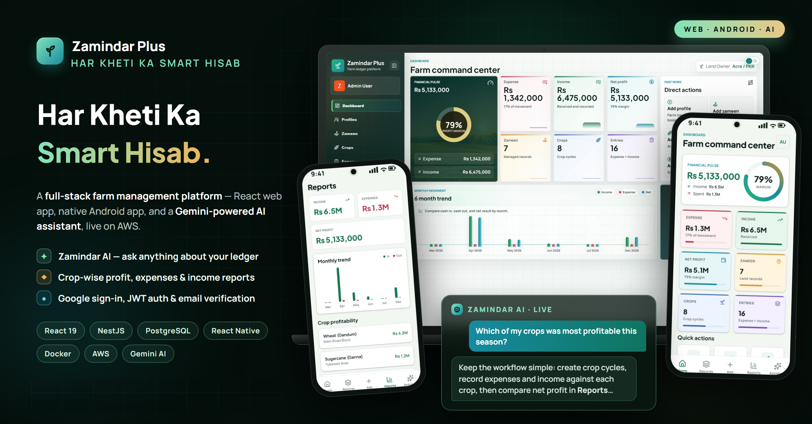
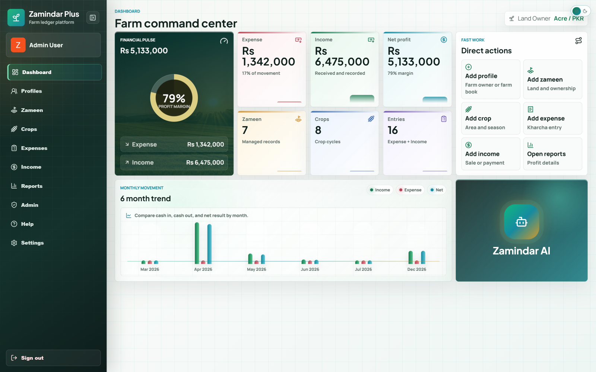
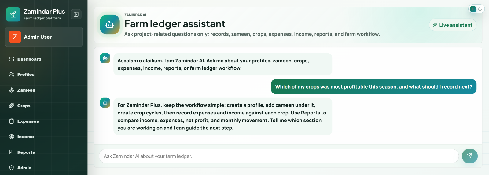
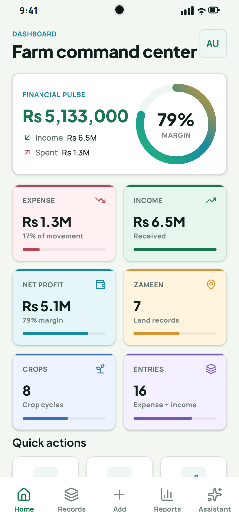
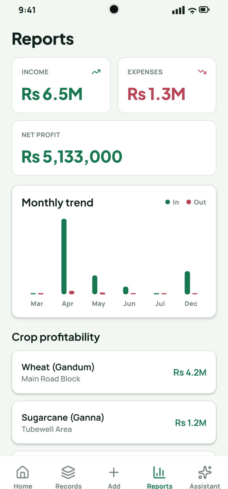

# Zamindar Plus

**Har Kheti Ka Smart Hisab**



Zamindar Plus is a farm ledger platform for managing profiles, zameen (land),
crops, expenses, income, reports, and account settings — with email
verification, password reset, and Google sign-in.

## Screenshots

_Captured from the live production deployment and a physical Android device._

**Web — farm command center**



**Web — Zamindar AI assistant (Gemini-powered)**



**Android app — home & reports**

<p>
  
  &nbsp;&nbsp;
  
</p>

## Stack

- **Web** (`apps/frontend`) — React 19 + Vite + TypeScript
- **API** (`apps/backend`) — NestJS 11 + TypeScript
- **Mobile** (`apps/mobile`) — React Native 0.86 (CLI, New Architecture + Hermes)
- **Database** — PostgreSQL + Prisma 7
- **Shared** (`packages/shared`) — area-conversion utilities (`@zamindar/shared`)
- Monorepo tooling — **npm workspaces**

## Repository layout

```text
zamindar-plus/
  apps/
    backend/    NestJS API
    frontend/   React + Vite web app
    mobile/     React Native app
  packages/
    shared/     shared utilities (@zamindar/shared)
  docs/         deployment docs
```

## Prerequisites

- **Node.js 24** (minimum 22.11) and npm
- **Docker** for the local PostgreSQL database (or a local Postgres install)
- For the mobile app: **JDK 17**, **Android Studio** + SDK (Platform-Tools/`adb`,
  an SDK Platform, NDK, CMake), the `ANDROID_HOME` environment variable, and a
  physical device or emulator

## Setup

### 1. Install all dependencies (one command, every workspace)

```bash
npm install
```

### 2. Create the env files

There are no committed `.env` files (they are gitignored). Copy the examples:

```bash
# Windows (PowerShell / cmd)
copy apps\backend\.env.example apps\backend\.env
copy apps\frontend\.env.example apps\frontend\.env

# macOS / Linux
cp apps/backend/.env.example apps/backend/.env
cp apps/frontend/.env.example apps/frontend/.env
```

The defaults work for local development. Fill in secrets only if you need them
(Google client ID, SMTP, Gemini key). `.env.production.example` documents the
full production variable set.

### 3. Start PostgreSQL

```bash
docker compose up -d
```

Starts Postgres on `localhost:5432` with the credentials the default
`DATABASE_URL` expects.

### 4. Generate the Prisma client and apply migrations

```bash
npm run prisma:generate
npm run prisma:migrate
```

## Running (each in its own terminal)

```bash
npm run dev:backend     # NestJS API  -> http://localhost:3000
npm run dev:frontend    # Vite web    -> http://localhost:5173
npm run android:mobile  # build + install the mobile app on a device/emulator
```

Default local URLs — Web `http://localhost:5173`, API `http://localhost:3000`,
Postgres `localhost:5432`.

> **Local tip:** with `NODE_ENV=development` the API returns the email
> verification / password-reset code in the response (`devVerificationToken`),
> so you can complete signup without configuring SMTP. Set
> `EMAIL_DELIVERY_ENABLED=true` plus the `SMTP_*` values to send real emails.

## Mobile app note

The mobile app talks to the **production** API by default (hard-coded in
`apps/mobile/src/config.ts`), so you can develop it without running the backend,
frontend, or database locally — just `npm install`, set up the Android
toolchain, and `npm run android:mobile`. See `apps/mobile/README.md` and
`apps/mobile/DEPLOYMENT.md` (release / signed-APK build) for details.

## Useful commands

```bash
npm run build            # build frontend + backend
npm run lint             # lint frontend + backend + mobile
npm run typecheck:mobile
npm run test:mobile
npm run check            # build + typecheck + lint + test (full gate)
```

## Notes

- Production deployment (EC2 + Docker + RDS) lives in `docker-compose.prod.yml`
  and `docs/`.
- The real `.env.production` stays on the server and is never committed.
- Real email delivery requires SMTP values in `apps/backend/.env`.
- Google sign-in requires matching frontend and backend Google OAuth client IDs.
